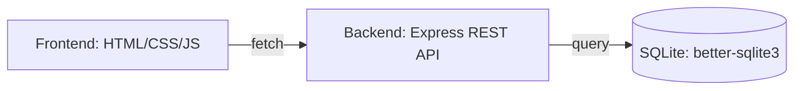

# 🛒 The Provisioner

**The Provisioner** is a complete, full-stack e-commerce web application designed for performance and simplicity. It features a robust Node.js/Express REST API with JWT authentication and a SQLite database, paired with a clean, vanilla HTML/CSS/JS storefront and admin dashboard.


## ✨ Key Features

### Storefront

* **Product Discovery:** Browse the catalog with search, category filtering, price sorting, and pagination.
* **Interactive Details:** View product information with star ratings and customer reviews.
* **Persistent Cart:** Seamless shopping experience using `localStorage` with real-time quantity management.
* **Secure Checkout:** Atomic order placement with transactional stock decrement.
* **Order Tracking:** View personalized order history for logged-in customers.

### Admin Dashboard

* **KPI Tracking:** Monitor revenue, orders, customers, and product performance.
* **Analytics:** View 30-day revenue trends and identify top-performing products via `/admin/stats`.
* **Order & Inventory Management:** Update order statuses (pending → paid → shipped → delivered) and manage product stock levels.

### Security & API

* **Authentication:** Robust register/login system utilizing `bcrypt` password hashing and JWT tokens.
* **Access Control:** Role-based access control (RBAC) distinguishing between `customer` and `admin` permissions.
* **Input Validation:** Strict server-side validation using `express-validator` on all mutating endpoints.

---

## 🏗️ Architecture



---

## 🚀 Quick Start

### Prerequisites

* [Node.js](https://nodejs.org/) installed
* [Python 3](https://www.python.org/) (for serving the frontend)

### Backend Setup

1. **Clone the repository:**
```bash
git clone https://github.com/theabdulwasay/The-Provisioner.git
cd The-Provisioner/backend

```


2. **Install dependencies and configure:**
```bash
npm install
cp .env.example .env

```


3. **Seed database and start:**
```bash
npm run seed
npm start

```


*API will run at `http://localhost:4000`.*

### Frontend Setup

In a new terminal window:

```bash
cd The-Provisioner/frontend
python3 -m http.server 8080

```

*Open `http://localhost:8080` in your browser.*

---

## 🧪 Testing

The project includes a comprehensive suite of 11 automated tests using **Jest** and **Supertest** to cover core functionalities like authentication, product management, and transactional order logic.

```bash
cd backend
npm test

```

---

## 🛠️ Tech Stack

* **Backend:** Node.js, Express, better-sqlite3, bcryptjs, jsonwebtoken, express-validator
* **Frontend:** Vanilla HTML/CSS/JS
* **Testing:** Jest, Supertest
* **Deployment:** Docker / Docker Compose

---

## 📄 License

This project is licensed under the [MIT License](https://www.google.com/search?q=LICENSE).


